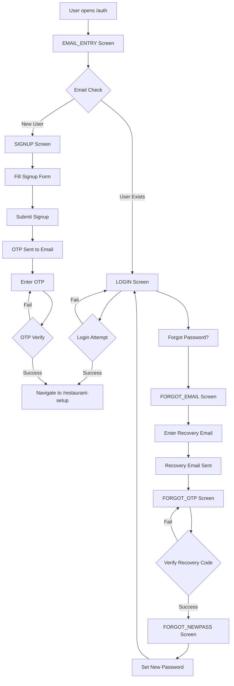

# Partner_Auth.tsx - Complete Workflow Report

**File**: `Partner_Auth.tsx`  
**Purpose**: Partner Authentication Portal  
**Technology**: React + Supabase Auth + Zod Validation

---

## 🎯 Overview

Partner_Auth.tsx ek comprehensive authentication system ha jo restaurant partners k lie design kia gaya ha. Ye multiple authentication flows support krta ha including signup, login, OTP verification, or password recovery.

---

## 🔑 Key Features

### 1. **Smart Email Detection System**
- User pehle apna email enter krta ha
- System automatically check krta ha k user exist krta ha ya nahi
- **Existing user** → Login form
- **New user** → Signup form

### 2. **International Phone Support**
- Top 10 countries k flags or dial codes
- Country-specific phone validation patterns
- Dropdown selector for easy selection

### 3. **Multi-Step Authentication Flows**
- Email Entry → Login/Signup decision
- OTP Verification (for signup)
- Password Recovery (3-step process)

### 4. **Premium UI/UX**
- Luxury image portal with Ken Burns effect
- Floating label inputs with autofill detection
- Smooth animations (Framer Motion)
- Gold/Black premium theme

---

## 📊 Complete Workflow Diagram



---

## 🚀 Authentication Views (States)

| View | Purpose | Required Fields |
|------|---------|----------------|
| `EMAIL_ENTRY` | Initial screen - email check | Email |
| `LOGIN` | Existing user login | Email, Password |
| `SIGNUP` | New user registration | Name, Restaurant Name, Phone, Email, Password |
| `FORGOT_EMAIL` | Password recovery start | Email |
| `FORGOT_OTP` | Recovery code verification | OTP Code |
| `FORGOT_NEWPASS` | Set new password | New Password, Confirm Password |

---

## 🔐 Validation Schemas (Zod)

### Signup Schema
```tsx
{
  owner_name: min 2 chars,
  restaurant_name: min 2 chars,
  phone: country-specific pattern,
  email: valid email,
  password: min 6 chars,
  confirmPassword: must match password
}
```

### Login Schema
```tsx
{
  email: valid email,
  password: required
}
```

### Country-Specific Phone Patterns
- **Pakistan**: `3XXXXXXXXX` (10 digits starting with 3)
- **USA/Canada**: `XXXXXXXXXX` (10 digits, no 0/1 start)
- **UAE**: `5XXXXXXXX` (9 digits starting with 5)
- **UK**: `7XXXXXXXXX` (10 digits starting with 7)

---

## 💾 Supabase Integration

### Signup Flow
```tsx
supabase.auth.signUp({
  email: email,
  password: password,
  options: {
    data: {
      role: 'partner',
      owner_name: name,
      restaurant_name: restaurant,
      phone: '+92xxxxxxxxxx'
    }
  }
})
```

### Login Flow
```tsx
supabase.auth.signInWithPassword({
  email: email,
  password: password
})
```

### OTP Verification
```tsx
supabase.auth.verifyOtp({
  email: email,
  token: otp_code,
  type: 'email'
})
```

### Password Recovery
1. **Send Recovery Email**
```tsx
supabase.auth.resetPasswordForEmail(email)
```

2. **Verify OTP**
```tsx
supabase.auth.verifyOtp({
  email: email,
  token: code,
  type: 'recovery'
})
```

3. **Update Password**
```tsx
supabase.auth.updateUser({
  password: new_password
})
```

---

## 🎨 UI Components

### 1. FloatingLabelInput
- Smart label positioning
- Autofill detection
- Password visibility toggle
- Smooth transitions

### 2. CountryDropdown
- Visual flag display
- Dial code display
- Searchable (future enhancement)
- Validated selection

### 3. LuxuryImagePortal
- Ken Burns zoom effect (30s cycle)
- Floating animation
- Golden glow borders
- Responsive design

---

## 🔄 User Journey Example

### New User Signup:
1. **Step 1**: Enter email → System detects "new user"
2. **Step 2**: Fill signup form (Name, Restaurant, Phone, Password)
3. **Step 3**: Click "Create Account"
4. **Step 4**: Receive OTP email
5. **Step 5**: Enter 6-digit OTP code
6. **Step 6**: ✅ Account verified → Redirect to `/restaurant-setup`

### Existing User Login:
1. **Step 1**: Enter email → System detects "existing user"
2. **Step 2**: Enter password
3. **Step 3**: Click "Sign In"
4. **Step 4**: ✅ Login successful → Redirect to `/restaurant-setup`

### Password Recovery:
1. **Step 1**: Click "Forgot Password?"
2. **Step 2**: Enter email → Recovery email sent
3. **Step 3**: Check email for recovery code
4. **Step 4**: Enter recovery code
5. **Step 5**: Set new password
6. **Step 6**: ✅ Password updated → Back to Login

---

## 📱 Navigation Flow

```
/auth (Partner_Auth)
  ├── SUCCESS: New User → /restaurant-setup
  ├── SUCCESS: Existing User → /restaurant-setup  
  └── CANCEL: User can navigate to /partner (landing page)
```

---

## 🛡️ Security Features

1. **Password Requirements**: Minimum 6 characters
2. **Email Validation**: Standard RFC compliance
3. **Phone Validation**: Country-specific patterns
4. **OTP Expiration**: Supabase handles automatically
5. **Password Visibility Toggle**: User control
6. **Form Validation**: Real-time with Zod schemas

---

## 🎯 Success Indicators

- ✅ Toast notifications for all actions
- ✅ Loading states during API calls
- ✅ Error messages with specific guidance
- ✅ Auto-redirect after successful auth
- ✅ Form reset after completion

---

## 📌 Key State Variables

```tsx
const [mode, setMode] = useState<'login' | 'signup'>('login');
const [authView, setAuthView] = useState<ViewType>('EMAIL_ENTRY');
const [isOtpSent, setIsOtpSent] = useState(false);
const [email, setEmail] = useState('');
const [selectedCountry, setSelectedCountry] = useState(TOP_COUNTRIES[0]);
const [loading, setLoading] = useState(false);
```

---

## 🔧 Integration Points

1. **Supabase Auth** - Backend authentication
2. **React Hook Form** - Form management
3. **Zod** - Validation
4. **Framer Motion** - Animations
5. **Sonner** - Toast notifications
6. **React Router** - Navigation

---

## 🎨 Design Philosophy

- **Luxury First**: Gold/Black premium aesthetic
- **User-Centric**: Smart email detection reduces friction
- **International**: Multi-country support
- **Responsive**: Works on all screen sizes
- **Accessible**: Proper labels, ARIA attributes
